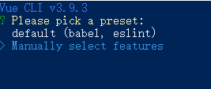
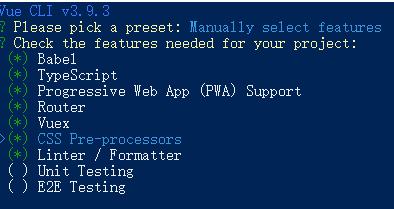
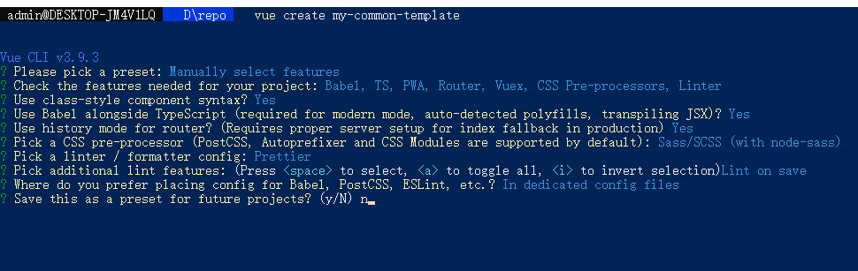
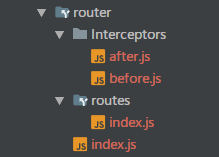
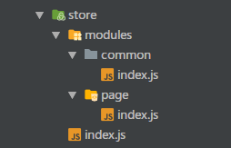

# Vue Cli 3 项目搭建总结

## 搭建步骤

> 得益于Vue Cli 3 ，Vue 有了自己的图形管理界面，使用vue ui即可进入，在这儿不做介绍，只介绍一下控制台新建项目的步骤。

#### **1. 首先你总得安装这个Vue Cli 3 的包吧**。（我的版本为3.9.3）

```text
npm install -g @vue/cli
# OR
yarn global add @vue/cli
```

**2. 然后运行以下指令来创建一个新项目。**

```text
vue create <项目名称>
```

#### 3. 然后如下图所示







#### 4. 这时候项目就已经搭建成功了。

## 项目配置

> 在项目搭建完成之后，就要进入项目对一些选项进行配置，例如vue-router、vuex、prettier、vue.config.js配置等等。

#### eslint + prettier配置

在搭建项目时，我选择了`eslint+prettier`的代码格式化工具，然后，我们需要在项目根目录下创建一个`prettier.config.js`文件，用于进行prettier的配置。（[配置参数官网直译](https://segmentfault.com/a/1190000012909159)）

```javascript
/**
 * @author: Wang.X.Y/comrade.wang.cn@gmail.com
 * @Date: 2018/12/3
 * @Time: 17:04
 * @Description: 这是二课项目的配置项，具体的可以根据项目更改
 */
module.exports = {
  // tab缩进大小,默认为2
  tabWidth: 2,
  // 使用tab缩进，默认false
  useTabs: false,
  // 使用分号, 默认true
  semi: true,
  // 使用单引号, 默认false(在jsx中配置无效, 默认都是双引号)
  singleQuote: true,
  // 行尾逗号,默认none,可选 none|es5|all
  // es5 包括es5中的数组、对象
  // all 包括函数对象等所有可选
  trailingComma: 'none',
  // 对象中的空格 默认true
  // true: { foo: bar }
  // false: {foo: bar}
  bracketSpacing: false,
  // JSX标签闭合位置 默认false
  // false: <div
  //          className=""
  //          style={{}}
  //       >
  // true: <div
  //          className=""
  //          style={{}} >
  jsxBracketSameLine: false,
  // 箭头函数参数括号 默认avoid 可选 avoid| always
  // avoid 能省略括号的时候就省略 例如x => x
  // always 总是有括号
  arrowParens: 'always'
};
```

#### vue.config.js配置

在项目的根目录下创建`vue.config.js`文件。（[官方文档戳我 &gt;&gt;](https://cli.vuejs.org/zh/config/#)）

```javascript
/**
 * @author: Wang.X.Y/comrade.wang.cn@gmail.com
 * @Date: 2018/10/18
 * @Time: 15:15
 * @Description: vue.config.js 配置说明
 */
//官方vue.config.js 参考文档 https://cli.vuejs.org/zh/config/#
// 这里只列一部分，具体配置参考文档
module.exports = {
  // 部署生产环境和开发环境下的URL。
  // 默认情况下，Vue CLI 会假设你的应用是被部署在一个域名的根路径上
  //例如 https://www.my-app.com/。如果应用被部署在一个子路径上，你就需要用这个选项指定这个子路径。例如，如果你的应用被部署在 https://www.my-app.com/my-app/，则设置 baseUrl 为 /my-app/。
  publicPath: process.env.NODE_ENV === 'production' ? './' : '/',
  assetsDir: './',
  css: {
    loaderOptions: {
      sass: {
        data: `
          @import "@/assets/styles/variable/index.scss";
        `
      }
    }
  },

  // outputDir: 在npm run build 或 yarn build 时 ，生成文件的目录名称（要和baseUrl的生产环境路径一致）
  // outputDir: "dist",
  //用于放置生成的静态资源 (js、css、img、fonts) 的；（项目打包之后，静态资源会放在这个文件夹下）
  // assetsDir: "assets",
  //指定生成的 index.html 的输出路径  (打包之后，改变系统默认的index.html的文件名)
  // indexPath: "myIndex.html",
  //默认情况下，生成的静态资源在它们的文件名中包含了 hash 以便更好的控制缓存。你可以通过将这个选项设为 false 来关闭文件名哈希。(false的时候就是让原来的文件名不改变)
  filenameHashing: true,

  //   lintOnSave：{ type:Boolean default:true } 问你是否使用eslint
  lintOnSave: true,
  //如果你想要在生产构建时禁用 eslint-loader，你可以用如下配置
  // lintOnSave: process.env.NODE_ENV !== 'production',

  //是否使用包含运行时编译器的 Vue 构建版本。设置为 true 后你就可以在 Vue 组件中使用 template 选项了，但是这会让你的应用额外增加 10kb 左右。(默认false)
  // runtimeCompiler: false,
  // 配置webpack
  /**
   * 如果你不需要生产环境的 source map，可以将其设置为 false 以加速生产环境构建。
   *  打包之后发现map文件过大，项目文件体积很大，设置为false就可以不输出map文件
   *  map文件的作用在于：项目打包后，代码都是经过压缩加密的，如果运行时报错，输出的错误信息无法准确得知是哪里的代码报错。
   *  有了map就可以像未加密的代码一样，准确的输出是哪一行哪一列有错。
   * */
  productionSourceMap: false,

  // 它支持webPack-dev-server的所有选项
  devServer: {
    host: 'localhost',
    port: 8888, // 端口号
    https: false, // https:{type:Boolean}
    open: true, //配置自动启动浏览器
    // proxy: 'http://localhost:4000' // 配置跨域处理,只有一个代理

    // 配置多个代理
    proxy: {
      '/api': {
        target: 'http://localhost:8080',
        ws: true,
        changOrigin: true,
        pathRewrite: {
          '^/api': '/'
        }
      },
      '/online': {
        target: 'http://10.96.129.57:8081',
        ws: true,
        changOrigin: true,
        pathRewrite: {
          '^/online': '/'
        }
      }
    }
  }
}

```

#### vue-router的配置

在src目录下新建`router`文件夹，并在文件夹下新建`index.js`

```javascript
// @/src/router/index.js
import Vue from 'vue'
import Router from 'vue-router'
import Routes from './routes'
import before from './Interceptors/before'
import after from './Interceptors/after'

Vue.use(Router)

const router = new Router({
  mode: 'history',
  base: process.env.BASE_URL,
  routes: Routes
})

router.beforeEach(before)

router.afterEach(after)

export default router

```

新建router/routes 文件夹，并在文件夹下新建index.js

```javascript
/**
 * @author: Wang.X.Y/comrade.wang.cn@gmail.com
 * @Date: 2019/7/31
 * @Time: 19:10
 * @Description: 路由路径配置
 */
import Home from '../../views/Home.vue'
const routes = [
  {
    path: '/',
    name: 'home',
    component: Home
  },
  {
    path: '/about',
    name: 'about',
    // route level code-splitting
    // this generates a separate chunk (about.[hash].js) for this route
    // which is lazy-loaded when the route is visited.
    component: () =>
      import(/* webpackChunkName: "about" */ '../../views/About.vue')
  }
]

export default routes
```

新建`router/Interceptors`文件夹，存放路由的守卫

```javascript
/**
 * @author: Wang.X.Y/comrade.wang.cn@gmail.com
 * @Date: 2019/7/31
 * @Time: 19:30
 * @Description: 路由后置守卫
 */
// @/src/router/Interceptors/after
export default (to, from) => {}
```

```javascript
/**
 * @author: Wang.X.Y/comrade.wang.cn@gmail.com
 * @Date: 2019/7/31
 * @Time: 19:30
 * @Description:  路由前置守卫
 */
// @/src/router/Interceptors/before
export default (to, from, next) => {
  next()
}

```

最后的文件目录如下图



最后，不要忘记在`main.js`中引用router模块。

#### vuex配置

在src目录下，新建`store`文件夹，并在该文件夹下新建`index.js`根文件。

```javascript
/**
 * @author: Wang.X.Y/comrade.wang.cn@gmail.com
 * @Date: 2018/11/22
 * @Time: 10:00
 * @Description: store index 根文件
 */
import Vue from 'vue'
import Vuex from 'vuex'
import createLogger from 'vuex/dist/logger'
import common from './modules/common'
import page from './modules/page'
Vue.use(Vuex)

const debug = process.env.NODE_ENV !== 'production'
export default new Vuex.Store({
  modules: {
    common,
    page
  },
  strict: debug,
  plugins: debug ? [createLogger()] : []
})
```

在`src/store`项目目录下新建`modules`文件夹，用于存放vuex模块。

```javascript
/**
 * @author: Wang.X.Y/comrade.wang.cn@gmail.com
 * @Date: 2018/11/22
 * @Time: 10:09
 * @Description: 公共状态
 */
 // @/src/store/modules/common/index.js
const state = {
  show: false,
  token: sessionStorage.getItem('token') || ''
}
const getters = {
  not_show (state) {
    return !state.show
  },
  get_token (state) {
    return state.token
  }
}
const mutations = {
  switch_show (state) {
    state.show = !state.show
  },
  set_token (state, token) {
    sessionStorage.setItem('token', token)
    state.token = token
  },
  del_token (state) {
    sessionStorage.removeItem('token')
    state.token = ''
  }
}
const actions = {
  switch_show (context) {
    context.commit('switch_show')
  },
  set_token ({commit}, token) {
    commit('set_token', token)
  },
  del_token ({commit}) {
    commit('del_token')
  }
}

export default {
  namespaced: true,
  state,
  getters,
  actions,
  mutations
}
```

最终，vuex项目目录如下图。



最后，同样不要忘记在`main.js`中引用。

## 项目中问题总结

* [Huksy、lint-staged commit时自动调用Prettier进行格式化](http://ju.outofmemory.cn/entry/335890)
* [axios把接口提取到api中分模块的js文件中](https://www.jianshu.com/p/c639ebd50c07)


